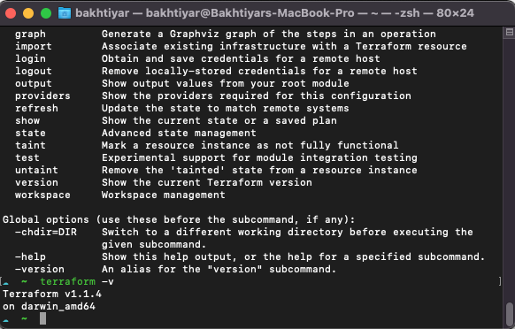

# Day 1 of Terraform Learning path

Before starting with Terraform it is worth to mention what is the logic behind the IaC (Infrastructure as Code). 

>"Infrastructure as Code (IaC) is the process of configuring and managing the infrastructure through a descriptive model. It is all about treating your infrastructure configuration and provisioning in the same way you treat your application source code. The configuration modules are typically stored in version control systems in very well-documented code formats which provides greater accuracy, reduces errors, and increases speed and consistency.

>IAC is one of the most important DevOps practices used in conjunction with continuous delivery. The benefits that lead many businesses to migrate to IAC are changeless infrastructure, an increase in the speed of delivery, scalability, cost savings, and risk mitigation.
IaC allows DevOps teams to use different tools and approaches to automatically control and customize the required infrastructure, instead of manually configuring the servers and operating systems. With the increase in the number of production and delivery cycles, the use of Infrastructure as Code (IaC) tools has changed the way software engineers design, test, and release their applications.

>Automation tools that promote the IaC best practices are necessary to make the process of building and configuring the infrastructure more competitive and effective, reducing the costs and effort involved." 
 
><cite> -- [NexaStack](https://www.nexastack.com/blog/best-iac-tools)<cite>


### Advantages of Infrastructure as Code
- Automated deployment
- Repeatable process
- Consistent environment (such as, production, staging, dev etc.)
- Reusable components
- Self-documented infrastructure architecture

### Introduction to Terraform
HashiCorp Terraform is the most popular and open-source tool for infrastructure automation. It helps in configuring, provisioning, and managing the infrastructure as code. With terraform, you can easily plan and create IaC across multiple infrastructure providers with the same workflow. It uses the declarative approach to define the required infrastructure as code. Terraform allows users to have a pre-execution check to validate whether the configurations meet the result expectations or not, before updating or provisioning the infrastructure. It enables users to have their desired infrastructure across multiple cloud providers through a single and consistent CLI workflow. You can easily provision different environments using the same configuration and manage the full lifecycle of your desired infrastructure; thus reducing human errors and increasing automation in the infrastructure provisioning and management process.

Terraform is a vendor agnostic IaC tools means it can be easily used for provisioning resources in AWS, GCP or any other major cloud vendor. Within the configuration files, you can define the resources and their attributes. Terraform will automatically create the infrastructure based on the configuration. Either HashiCorp Configuration Language (HCL) or JSON is the appropriate format for defining the resources and their attributes. It is worth to mention that options are not limited to only above mentioned options in terms of syntax. 

Please note that HCL or JSON is not the only format supported by Terraform. You can even use programming language of your choice including TypeScript, Python, and Go to define the resources and their attributes with the help of Cloud Development Kit for Terraform. For more info check out [CDKTF documentation](https://learn.hashicorp.com/collections/terraform/cdktf).

Terraform uses push model for creating the resources means it will create the resources in the cloud when you push your local configuration changes. 

Terraform consists of 4 core components:
- **Terraform CLI** - a single binary that can be used to create, plan, and apply the infrastructure as code. Single binary compiled from Go.
- **Configuration files** - a declarative format for defining the resources and their attributes.
- **Terraform Provider** - a plugin that provides the functionality to create the infrastructure as code. Talks with the APIs of specific cloud providers.
- **Terraform State** - a file that contains the state of the infrastructure as code. It is basically a mapping of the what is defined in config files and what is actually created in the cloud.

### Installation of Terraform

1. Download the Terraform executable from the [Terraform website](https://www.terraform.io/downloads.html)
2. Install the Terraform executable on your local machine.
3. Make sure it is available on your terminal (e.g. `which terraform`) (if not, add it to your PATH in Windows, or in your `.bashrc` file in Linux/Mac)

#### Installation for Mac OSX via Homebrew package manager

1. Update brew package manager via commands below:
  ```bash 
    brew update
    brew upgrade
  ```
2. Install the HashiCorp tap, a repository of all our Homebrew packages.
    ```bash 
    brew tap hashicorp/tap
    ```
3. Install Terraform via the following command:
    ```bash 
    brew install hashicorp/tap/terraform
    ```
4. Verify that Terraform is installed by running the following command:
    ```bash 
    terraform -v
    ```


    

    Also you can similary use apt-get for Linux or chocolatey for Windows to install Terraform.


### HashiCorp Configuration Language (HCL) syntax

HashiCorp configuration language uses Bloc syntax to define the resources and their attributes. It is a declarative language that is easy to read and understand. It is also a human readable format. Each block starts with definition of block type, label and their attributes.

```hcl
block_type "label" "label_name" {
    key = "value"
}
```
It is also possible to define nested blocks (blocks within another block).
```hcl
block_type "label" "label_name" {
    key = "value"
    block_type "label" "label_name" {
        key = "value"
    }
}
```
If you want to refer a property from another block, you can use the following syntax:
resource_type.name_label.attribute_name

```hcl
resource "aws_instance" "web_server" {
    name = "web-server"
    ebs_volume {
        size = 100
    }
}   
```
For the defined block above we can use the following syntax to refer the name attribute:
```hcl
aws_instance.web_server.name
```

